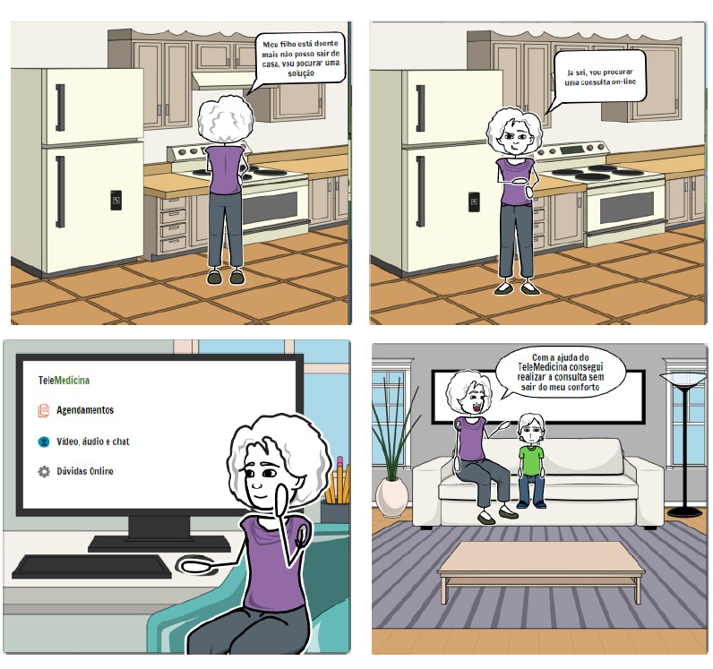
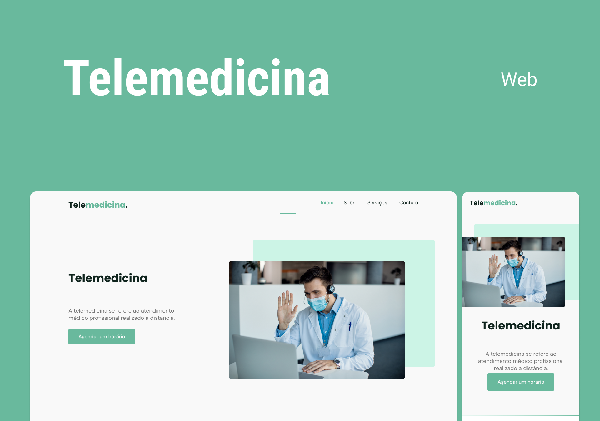

# Engenharia de software aplicada Aplicao web para telemedicina

  Participantes

- Adma Mota Alves Ribeiro Filho

- Bruno Duarte Viana

- Joanderson Trajano de Araújo

- José Iran Matos Junior

2-Descrição do sistema

  3-Storyboard

  4-Wireframe

Você pode visualizar o layout do projeto através [desse link](https://www.figma.com/file/ZCArH49ElbBNT9M7UylZzY/Telemedicina?node-id=120%3A3). É necessário ter conta no [Figma](https://figma.com) para acessá-lo.
